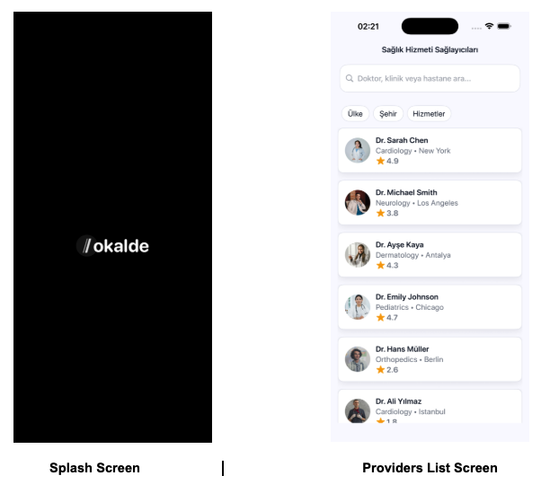
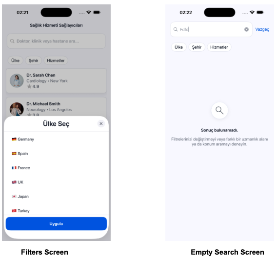
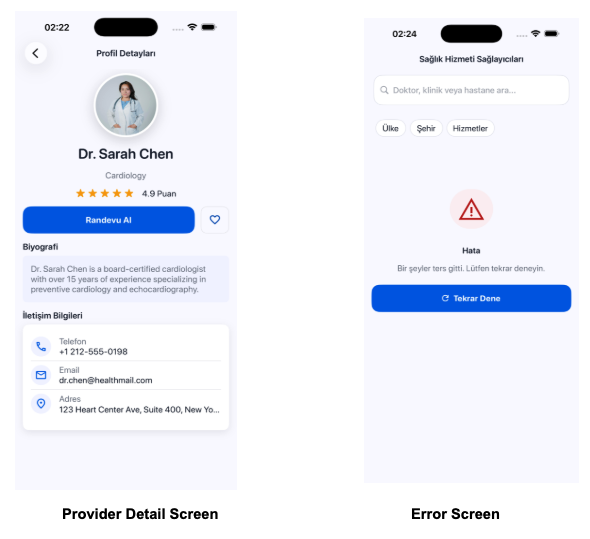

# Lokalde Case Study 🚀

Bu proje, iOS platformunda modern tasarım desenleri, temiz kod (Clean Code) prensipleri ve sürdürülebilir mimari yaklaşımları kullanılarak geliştirilmiş bir örnek olay (Case Study) çalışmasıdır.
---
## 🎥 Proje Tanıtım Videosu

Projeyi mimari kararlar, filtreleme algoritması ve kullanıcı deneyimi detaylarıyla anlattığım 10 dakikalık kısa sunumu aşağıdan izleyebilirsin:

  

## 🏗 Mimari Tercihler ve Kod Organizasyonu

Projede **MVVM-C (Model-View-ViewModel-Coordinator)** mimarisi tercih edilmiştir. 
* **Ayrılmış Sorumluluklar (Separation of Concerns):** View Controller'lar yalnızca UI güncellemeleri ve kullanıcı etkileşimlerini yakalamakla görevlendirilmiş, tüm iş mantığı (business logic) ve veri manipülasyonu ViewModel'lere taşınmıştır.
* **Protokol Odaklı Programlama (POP):** ViewModel'ler View Controller'lara doğrudan değil, `Interface` protokolleri üzerinden enjekte edilmiştir (Dependency Injection). Bu sayede sınıflar arası sıkı bağlar (tight coupling) koparılmış ve kod test edilebilir (Mockable) hale getirilmiştir.
* **Merkezi Sabitler (Constants):** Uygulama içerisindeki tüm renk, font, boşluk (padding) ve gölge (shadow) ayarları `Constants` enum'ları altında toplanarak sihirli sayılar (magic numbers) ve tekrarlanan kodlar engellenmiştir.

## 🧭 Navigation Kurgusu

* **Coordinator Pattern:** Ekranlar arası geçiş ve yönlendirme mantığı View Controller'ların içinden tamamen çıkartılarak `AppCoordinator` sınıfına devredilmiştir. 
* **Delegation:** View Controller'lar, `ProvidersNavigationDelegate` gibi protokoller aracılığıyla bir sonraki adıma geçileceğini Coordinator'a bildirir. Bu sayede bir ekran, kendinden sonra hangi ekranın geleceğini bilmez; bu da modülerliği ve yeniden kullanılabilirliği maksimuma çıkarır.

## 🧩 Component Yapısı ve Yeniden Kullanılabilirlik

UI inşasında XIB ve programatik (Code-based) yaklaşım hibrit olarak kullanılmıştır. Tekrar eden arayüz elemanları için modüler Custom View'lar oluşturulmuştur:
* **`AppButton`:** Uygulamanın genel buton standartlarını (renk, köşe ovalliği) tek merkezden yönetir.
* **`StarRatingView`:** Puanlama göstergelerini dinamik olarak çizen, farklı ekranlarda (Liste ve Detay) boyutları ayarlanabilen bağımsız bir bileşendir.
* **`InfoStateView`:** Tüm ekranlarda kullanılabilecek, ortak bir hata/yükleniyor/boş durum bileşenidir.

## 🔄 State Yönetimi Yaklaşımı

* Veri akışı ve durum güncellemeleri, Closure'lar ve **Delegate Pattern** aracılığıyla sağlanmıştır.
* Kullanıcının eylemleri (örn: Filtre seçimi) ViewModel'e iletilir, ViewModel veriyi işler (DTO -> UI Model dönüşümü) ve View'a sadece ekranda gösterilmeye hazır, formatlanmış nihai veriyi paslar.

## 🔍 Gelişmiş Filtreleme Algoritması

Uygulama içerisindeki veri filtreleme mantığı, performans ve ölçeklenebilirlik göz önünde bulundurularak tasarlanmıştır:
* **Performans Odaklı Veri İşleme:** API'den gelen orijinal veri seti (`rawProviders`) hafızada güvenli bir şekilde mutasyona uğramadan tutulur. Filtreleme işlemi, Swift'in yüksek performanslı High-Order fonksiyonları (`filter`, `contains`) kullanılarak orijinal veriler üzerinden anlık olarak hesaplanır.
* **Dinamik Seçim Yönetimi (Stateful Filtering):** `FiltersViewModel` içerisinde kullanıcı seçimleri anlık olarak takip edilir. `toggleSelection` metodu ile filtre seçeneklerinin aktif/pasif durumları bellek dostu bir yaklaşımla güncellenilir ve anında View'a yansıtılır.
* **Kapsamlı Eşleştirme Mantığı:** Arama (Search) ve Filtreleme (Kategori, Şehir vb.) özellikleri birbirini ezmeden entegre çalışacak şekilde kurgulanmıştır. Kullanıcının aktif seçim kümesi, her veri değiştiğinde yeniden değerlendirilerek sıfır hatalı bir liste görünümü elde edilir.

## 🚦 Loading, Empty ve Error State'leri

Kullanıcıyı hiçbir zaman belirsizlikte bırakmamak adına state yönetimi titizlikle kurgulanmıştır:
* API istekleri veya veri filtreleme süreçlerinde ekranın uygun yerlerinde `InfoStateView` tetiklenir.
* Veri yüklenirken **Loading** durumu, arama/filtreleme sonucu bulunamadığında **Empty** durumu, herhangi bir ağ veya sunucu hatasında ise kullanıcı dostu mesajlarla **Error** durumu ekrana yansıtılır.

## 🛡 Null ve Eksik Veri Yönetimi

* **Güvenli Veri İşleme:** Backend'den veya veri kaynağından gelen, null (nil) olma ihtimali olan verileri taşıyan nesneler (`ProviderDTO`) doğrudan UI katmanına çıkartılmaz.
* **Safe Unwrapping:** ViewModel katmanında `guard-let` ve `if-let` yapıları kullanılarak veriler güvenli bir şekilde açılır (unwrap). Eksik veriler (örneğin gelmeyen bir puan bilgisi) için varsayılan (default) ve anlamlı değerler (`0.0` veya "Bilgi Yok") atanarak uygulamanın çökmesi (Crash) kesin olarak engellenmiştir.

## ✨ Genel Kullanıcı Deneyimi (UX)

Kullanıcı deneyimini "Premium" hissettirmek için iOS'in modern API'leri kullanılmıştır:
* **Navigation Bar:** iOS 15+ standartlarına uygun `UINavigationBarAppearance` kullanılarak, kaydırma (scroll) anında arka plan renginin bozulması veya Search Bar'ın gizlenmesi gibi sorunlar önlenmiştir. "Geri" tuşundaki kalabalık metinler kaldırılarak minimal bir ok tasarımı (`.minimal` display mode) tercih edilmiştir.
* **Görsel Derinlik:** Arayüzdeki kartlara ve profil fotoğraflarına hafif `shadow` (gölge) efektleri eklenerek, tasarımın ekranla bütünleşmesi yerine katmanlı ve modern durması sağlanmıştır.
* **Etkileşim:** İletişim bilgilerine (Telefon, E-posta, Adres) tıklandığında ilgili yerel iOS uygulamalarına (Telefon, Mail, Apple Haritalar) yönlendirme yapılarak kesintisiz bir deneyim sunulmuştur.

## 🧪 Test Yaklaşımı (Sürdürülebilirlik)

* İş mantığının doğru çalıştığını kanıtlamak adına `XCTest` framework'ü ile Unit Test entegrasyonu başlatılmıştır. 
* GIVEN-WHEN-THEN standartlarına uygun olarak filtreleme mantıkları (`FiltersViewModelTests`) test edilmiş, ViewModel'in arayüzden bağımsız olarak sağlıklı çalıştığı doğrulanmıştır.

## 📱 Uygulama Görselleri

  
  
  

---

## 👨‍💻 Geliştirici
**Mehmet Biçici**
